# Paris Through Five Eras — Project Archive

Public archive of the Blender scene history and rendered previews for a stylized animation of Paris across the Roman, medieval, 1700, 1850 and modern eras.

> This repository stores the catalog and preview thumbnails. The large Blender and MP4 files are attached to the [archive-2026-08-08 release](https://github.com/zhou-zhichao/paris-five-eras-archive/releases/tag/archive-2026-08-08).

## Featured videos

| Final 2-minute animation | Early base version |
| --- | --- |
| [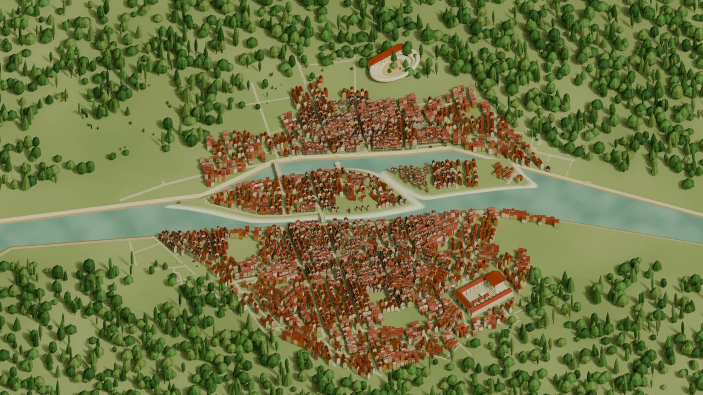](https://youtu.be/6st9cc6HeCs) | [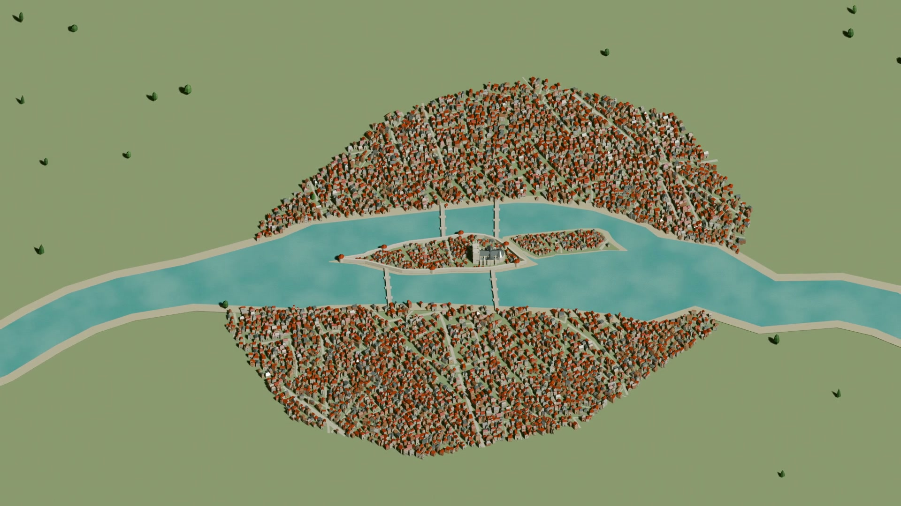](https://youtu.be/yC6kgCsfEdE) |
| [Watch on YouTube](https://youtu.be/6st9cc6HeCs) | [Watch on YouTube](https://youtu.be/yC6kgCsfEdE) |

## Archive summary

- 55 Blender scenes (.blend)
- 6 Blender backups (.blend1)
- 30 rendered or QA videos (.mp4)
- 21.47 GiB total release payload
- SHA-256 checksums in [SHA256SUMS.txt](SHA256SUMS.txt)
- Machine-readable metadata in [manifest.json](manifest.json)

## Rendered videos

Each thumbnail opens the downloadable MP4 attached to the release.

| Version | Preview | File | Size |
| --- | --- | --- | ---: |
| Unversioned |  | [encode_test_perceptual.mp4](https://github.com/zhou-zhichao/paris-five-eras-archive/releases/download/archive-2026-08-08/encode_test_perceptual.mp4) | 1.1 MiB |
| Unversioned |  | [encode_test.mp4](https://github.com/zhou-zhichao/paris-five-eras-archive/releases/download/archive-2026-08-08/encode_test.mp4) | 726.1 KiB |
| Unversioned | [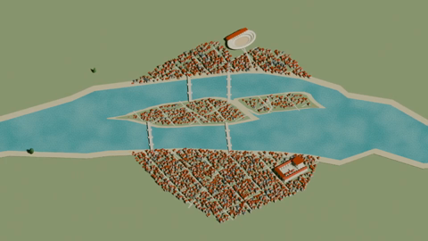](https://github.com/zhou-zhichao/paris-five-eras-archive/releases/download/archive-2026-08-08/medieval_transition_2min_timing.mp4) | [medieval_transition_2min_timing.mp4](https://github.com/zhou-zhichao/paris-five-eras-archive/releases/download/archive-2026-08-08/medieval_transition_2min_timing.mp4) | 3.8 MiB |
| Unversioned | [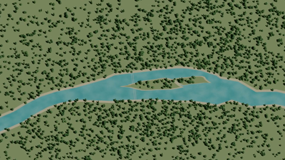](https://github.com/zhou-zhichao/paris-five-eras-archive/releases/download/archive-2026-08-08/opening_motion.mp4) | [opening_motion.mp4](https://github.com/zhou-zhichao/paris-five-eras-archive/releases/download/archive-2026-08-08/opening_motion.mp4) | 3.1 MiB |
| Unversioned | [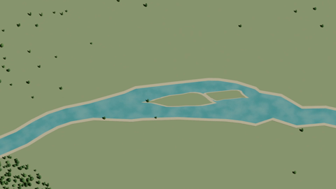](https://github.com/zhou-zhichao/paris-five-eras-archive/releases/download/archive-2026-08-08/paris_base_before_windows_eiffel.mp4) | [paris_base_before_windows_eiffel.mp4](https://github.com/zhou-zhichao/paris-five-eras-archive/releases/download/archive-2026-08-08/paris_base_before_windows_eiffel.mp4) | 51.5 MiB |
| Unversioned |  | [paris_base.mp4](https://github.com/zhou-zhichao/paris-five-eras-archive/releases/download/archive-2026-08-08/paris_base.mp4) · [YouTube](https://youtu.be/yC6kgCsfEdE) | 52.3 MiB |
| Unversioned | [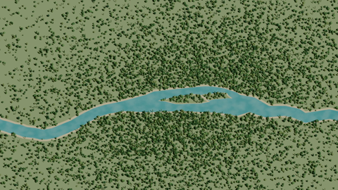](https://github.com/zhou-zhichao/paris-five-eras-archive/releases/download/archive-2026-08-08/paris_five_eras_blender_2min_1080p_minerva.mp4) | [paris_five_eras_blender_2min_1080p_minerva.mp4](https://github.com/zhou-zhichao/paris-five-eras-archive/releases/download/archive-2026-08-08/paris_five_eras_blender_2min_1080p_minerva.mp4) | 540.1 MiB |
| Unversioned | [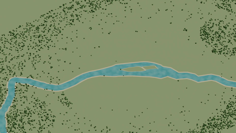](https://github.com/zhou-zhichao/paris-five-eras-archive/releases/download/archive-2026-08-08/paris_five_eras_blender_2min.mp4) | [paris_five_eras_blender_2min.mp4](https://github.com/zhou-zhichao/paris-five-eras-archive/releases/download/archive-2026-08-08/paris_five_eras_blender_2min.mp4) | 207.2 MiB |
| Unversioned |  | [timing_30f.mp4](https://github.com/zhou-zhichao/paris-five-eras-archive/releases/download/archive-2026-08-08/timing_30f.mp4) | 990.6 KiB |
| v2 |  | [paris_five_eras_blender_2min_v2.partial.mp4](https://github.com/zhou-zhichao/paris-five-eras-archive/releases/download/archive-2026-08-08/paris_five_eras_blender_2min_v2.partial.mp4) | 78.8 MiB |
| v2 | [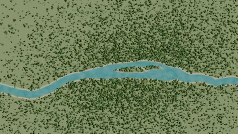](https://github.com/zhou-zhichao/paris-five-eras-archive/releases/download/archive-2026-08-08/paris_five_eras_timing_v2.mp4) | [paris_five_eras_timing_v2.mp4](https://github.com/zhou-zhichao/paris-five-eras-archive/releases/download/archive-2026-08-08/paris_five_eras_timing_v2.mp4) | 26.6 MiB |
| v3 | [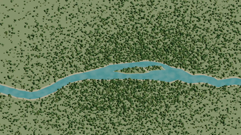](https://github.com/zhou-zhichao/paris-five-eras-archive/releases/download/archive-2026-08-08/paris_five_eras_sprout_v3_720p.mp4) | [paris_five_eras_sprout_v3_720p.mp4](https://github.com/zhou-zhichao/paris-five-eras-archive/releases/download/archive-2026-08-08/paris_five_eras_sprout_v3_720p.mp4) | 188.4 MiB |
| v3 | [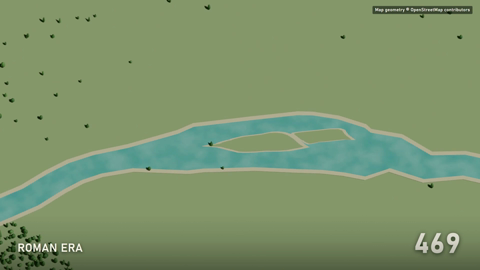](https://github.com/zhou-zhichao/paris-five-eras-archive/releases/download/archive-2026-08-08/paris_five_eras_v3.mp4) | [paris_five_eras_v3.mp4](https://github.com/zhou-zhichao/paris-five-eras-archive/releases/download/archive-2026-08-08/paris_five_eras_v3.mp4) | 86.5 MiB |
| v3 | [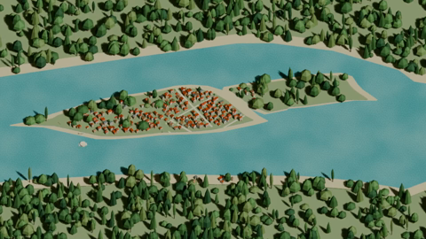](https://github.com/zhou-zhichao/paris-five-eras-archive/releases/download/archive-2026-08-08/sprout_v3_opening_segment.mp4) | [sprout_v3_opening_segment.mp4](https://github.com/zhou-zhichao/paris-five-eras-archive/releases/download/archive-2026-08-08/sprout_v3_opening_segment.mp4) | 1.9 MiB |
| v4 | [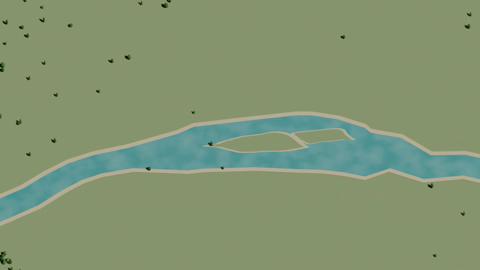](https://github.com/zhou-zhichao/paris-five-eras-archive/releases/download/archive-2026-08-08/paris_five_eras_blender_v4.mp4) | [paris_five_eras_blender_v4.mp4](https://github.com/zhou-zhichao/paris-five-eras-archive/releases/download/archive-2026-08-08/paris_five_eras_blender_v4.mp4) | 52.3 MiB |
| v9 | [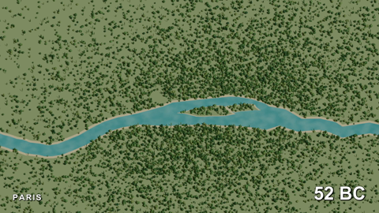](https://github.com/zhou-zhichao/paris-five-eras-archive/releases/download/archive-2026-08-08/paris_five_eras_v9_1080p_final.mp4) | [paris_five_eras_v9_1080p_final.mp4](https://github.com/zhou-zhichao/paris-five-eras-archive/releases/download/archive-2026-08-08/paris_five_eras_v9_1080p_final.mp4) | 289.2 MiB |
| v9 | [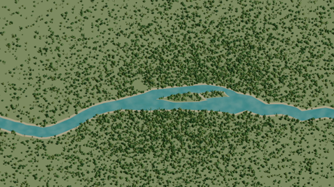](https://github.com/zhou-zhichao/paris-five-eras-archive/releases/download/archive-2026-08-08/paris_five_eras_v9_1080p_raw.mp4) | [paris_five_eras_v9_1080p_raw.mp4](https://github.com/zhou-zhichao/paris-five-eras-archive/releases/download/archive-2026-08-08/paris_five_eras_v9_1080p_raw.mp4) | 470.8 MiB |
| v9 | [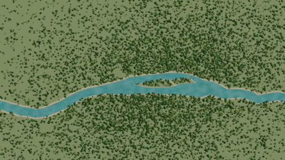](https://github.com/zhou-zhichao/paris-five-eras-archive/releases/download/archive-2026-08-08/paris_five_eras_v9_preview_360p_raw.mp4) | [paris_five_eras_v9_preview_360p_raw.mp4](https://github.com/zhou-zhichao/paris-five-eras-archive/releases/download/archive-2026-08-08/paris_five_eras_v9_preview_360p_raw.mp4) | 63.9 MiB |
| v9 | [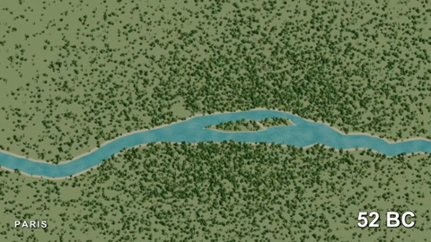](https://github.com/zhou-zhichao/paris-five-eras-archive/releases/download/archive-2026-08-08/paris_five_eras_v9_preview_360p.mp4) | [paris_five_eras_v9_preview_360p.mp4](https://github.com/zhou-zhichao/paris-five-eras-archive/releases/download/archive-2026-08-08/paris_five_eras_v9_preview_360p.mp4) | 53.3 MiB |
| v14 | [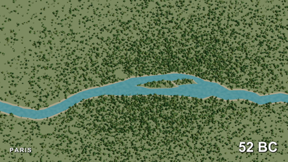](https://github.com/zhou-zhichao/paris-five-eras-archive/releases/download/archive-2026-08-08/paris_five_eras_sprout_v14_1080p_final.mp4) | [paris_five_eras_sprout_v14_1080p_final.mp4](https://github.com/zhou-zhichao/paris-five-eras-archive/releases/download/archive-2026-08-08/paris_five_eras_sprout_v14_1080p_final.mp4) | 295.7 MiB |
| v14 | [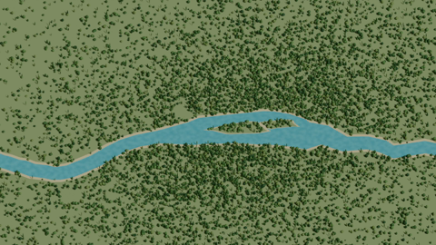](https://github.com/zhou-zhichao/paris-five-eras-archive/releases/download/archive-2026-08-08/paris_five_eras_sprout_v14_1080p_raw.mp4) | [paris_five_eras_sprout_v14_1080p_raw.mp4](https://github.com/zhou-zhichao/paris-five-eras-archive/releases/download/archive-2026-08-08/paris_five_eras_sprout_v14_1080p_raw.mp4) | 474.8 MiB |
| v16 | [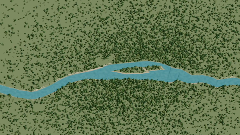](https://github.com/zhou-zhichao/paris-five-eras-archive/releases/download/archive-2026-08-08/paris_roman_medieval_v16_720p.mp4) | [paris_roman_medieval_v16_720p.mp4](https://github.com/zhou-zhichao/paris-five-eras-archive/releases/download/archive-2026-08-08/paris_roman_medieval_v16_720p.mp4) | 45.4 MiB |
| v17 | [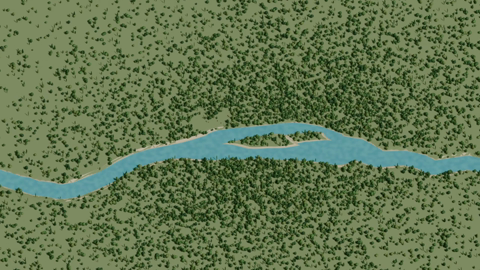](https://github.com/zhou-zhichao/paris-five-eras-archive/releases/download/archive-2026-08-08/paris_roman_medieval_v17_720p.mp4) | [paris_roman_medieval_v17_720p.mp4](https://github.com/zhou-zhichao/paris-five-eras-archive/releases/download/archive-2026-08-08/paris_roman_medieval_v17_720p.mp4) | 73.8 MiB |
| v17 | [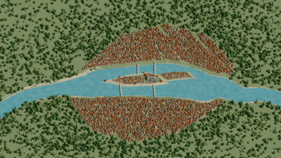](https://github.com/zhou-zhichao/paris-five-eras-archive/releases/download/archive-2026-08-08/paris_roman_medieval_v17_watercheck_f1430_1499.mp4) | [paris_roman_medieval_v17_watercheck_f1430_1499.mp4](https://github.com/zhou-zhichao/paris-five-eras-archive/releases/download/archive-2026-08-08/paris_roman_medieval_v17_watercheck_f1430_1499.mp4) | 2.1 MiB |
| v18 | [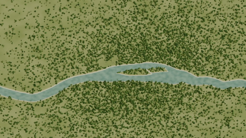](https://github.com/zhou-zhichao/paris-five-eras-archive/releases/download/archive-2026-08-08/paris_roman_medieval_v18_720p.mp4) | [paris_roman_medieval_v18_720p.mp4](https://github.com/zhou-zhichao/paris-five-eras-archive/releases/download/archive-2026-08-08/paris_roman_medieval_v18_720p.mp4) | 52.7 MiB |
| v18 |  | [v18_water_motion_qa.mp4](https://github.com/zhou-zhichao/paris-five-eras-archive/releases/download/archive-2026-08-08/v18_water_motion_qa.mp4) | 250.6 KiB |
| v20 |  | [paris_roman_medieval_v20_1080p.mp4](https://github.com/zhou-zhichao/paris-five-eras-archive/releases/download/archive-2026-08-08/paris_roman_medieval_v20_1080p.mp4) | 148.4 MiB |
| v30 | [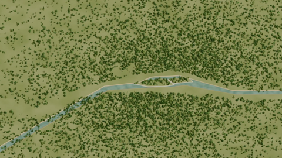](https://github.com/zhou-zhichao/paris-five-eras-archive/releases/download/archive-2026-08-08/paris_roman_medieval_v30_720p.mp4) | [paris_roman_medieval_v30_720p.mp4](https://github.com/zhou-zhichao/paris-five-eras-archive/releases/download/archive-2026-08-08/paris_roman_medieval_v30_720p.mp4) | 59.6 MiB |
| v37 |  | [paris_roman_medieval_v37_720p.mp4](https://github.com/zhou-zhichao/paris-five-eras-archive/releases/download/archive-2026-08-08/paris_roman_medieval_v37_720p.mp4) | 64.3 MiB |
| v44 | [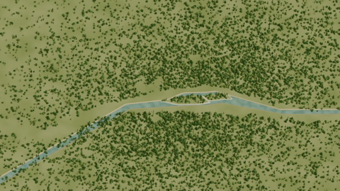](https://github.com/zhou-zhichao/paris-five-eras-archive/releases/download/archive-2026-08-08/paris_five_eras_v44_temple_enclosure_720p.mp4) | [paris_five_eras_v44_temple_enclosure_720p.mp4](https://github.com/zhou-zhichao/paris-five-eras-archive/releases/download/archive-2026-08-08/paris_five_eras_v44_temple_enclosure_720p.mp4) · [YouTube](https://youtu.be/6st9cc6HeCs) | 165.3 MiB |

## Blender scenes

| Version | File | Type | Size | SHA-256 prefix |
| --- | --- | --- | ---: | --- |
| Unversioned | [paris_5_eras_before_batched_sprouts.blend](https://github.com/zhou-zhichao/paris-five-eras-archive/releases/download/archive-2026-08-08/paris_5_eras_before_batched_sprouts.blend) | .blend | 109.5 MiB | $(@{name=paris_5_eras_before_batched_sprouts.blend; kind=blend; version=Unversioned; source_relative_path=blender/paris_5_eras_before_batched_sprouts.blend; size_bytes=114816684; sha256=850c2b311616e40da6e63c42b61a313237317f5dcc2f03a198329b06e702dc19; release_url=https://github.com/zhou-zhichao/paris-five-eras-archive/releases/download/archive-2026-08-08/paris_5_eras_before_batched_sprouts.blend}.sha256.Substring(0, 12)) |
| Unversioned | [paris_5_eras_minerva_1080p.blend](https://github.com/zhou-zhichao/paris-five-eras-archive/releases/download/archive-2026-08-08/paris_5_eras_minerva_1080p.blend) | .blend | 109.2 MiB | $(@{name=paris_5_eras_minerva_1080p.blend; kind=blend; version=Unversioned; source_relative_path=minerva_render/paris_5_eras_minerva_1080p.blend; size_bytes=114530134; sha256=a6edf998b0b6fe2b03bcf4c04887d01651dca27dd16b26c8fd7995388cfd335f; release_url=https://github.com/zhou-zhichao/paris-five-eras-archive/releases/download/archive-2026-08-08/paris_5_eras_minerva_1080p.blend}.sha256.Substring(0, 12)) |
| Unversioned | [paris_5_eras_pre_density_retime.blend](https://github.com/zhou-zhichao/paris-five-eras-archive/releases/download/archive-2026-08-08/paris_5_eras_pre_density_retime.blend) | .blend | 499.8 MiB | $(@{name=paris_5_eras_pre_density_retime.blend; kind=blend; version=Unversioned; source_relative_path=blender/paris_5_eras_pre_density_retime.blend; size_bytes=524063808; sha256=8f719aa09aba819a6bcf823bfa59a4afe02ecc691d4e95c56bc5094d19091247; release_url=https://github.com/zhou-zhichao/paris-five-eras-archive/releases/download/archive-2026-08-08/paris_5_eras_pre_density_retime.blend}.sha256.Substring(0, 12)) |
| Unversioned | [paris_5_eras.blend](https://github.com/zhou-zhichao/paris-five-eras-archive/releases/download/archive-2026-08-08/paris_5_eras.blend) | .blend | 529.1 MiB | $(@{name=paris_5_eras.blend; kind=blend; version=Unversioned; source_relative_path=blender/paris_5_eras.blend; size_bytes=554773731; sha256=bd9d15e892fac70fd074593098c423ceb28998b5755683a0491129da853a97d8; release_url=https://github.com/zhou-zhichao/paris-five-eras-archive/releases/download/archive-2026-08-08/paris_5_eras.blend}.sha256.Substring(0, 12)) |
| Unversioned | [paris_5_eras.blend1](https://github.com/zhou-zhichao/paris-five-eras-archive/releases/download/archive-2026-08-08/paris_5_eras.blend1) | .blend1 | 109.5 MiB | $(@{name=paris_5_eras.blend1; kind=blend1; version=Unversioned; source_relative_path=blender/paris_5_eras.blend1; size_bytes=114816684; sha256=850c2b311616e40da6e63c42b61a313237317f5dcc2f03a198329b06e702dc19; release_url=https://github.com/zhou-zhichao/paris-five-eras-archive/releases/download/archive-2026-08-08/paris_5_eras.blend1}.sha256.Substring(0, 12)) |
| v1 | [paris_5_eras_v1_before_growth_rework.blend](https://github.com/zhou-zhichao/paris-five-eras-archive/releases/download/archive-2026-08-08/paris_5_eras_v1_before_growth_rework.blend) | .blend | 499.8 MiB | $(@{name=paris_5_eras_v1_before_growth_rework.blend; kind=blend; version=v1; source_relative_path=blender/paris_5_eras_v1_before_growth_rework.blend; size_bytes=524063808; sha256=6e31991ec07d69cb80d68077ca89bf73dee928e0ececc4ec390605ee2760a439; release_url=https://github.com/zhou-zhichao/paris-five-eras-archive/releases/download/archive-2026-08-08/paris_5_eras_v1_before_growth_rework.blend}.sha256.Substring(0, 12)) |
| v2 | [paris_5_eras_v2_before_rail_land_fix.blend](https://github.com/zhou-zhichao/paris-five-eras-archive/releases/download/archive-2026-08-08/paris_5_eras_v2_before_rail_land_fix.blend) | .blend | 522.6 MiB | $(@{name=paris_5_eras_v2_before_rail_land_fix.blend; kind=blend; version=v2; source_relative_path=blender/paris_5_eras_v2_before_rail_land_fix.blend; size_bytes=548004400; sha256=b6bf251990a55ed189abe82b2e3920c46a1b5106e86a0d79ff7ce2893946b4a2; release_url=https://github.com/zhou-zhichao/paris-five-eras-archive/releases/download/archive-2026-08-08/paris_5_eras_v2_before_rail_land_fix.blend}.sha256.Substring(0, 12)) |
| v2 | [paris_5_eras_v2_pre_tail_stretch.blend](https://github.com/zhou-zhichao/paris-five-eras-archive/releases/download/archive-2026-08-08/paris_5_eras_v2_pre_tail_stretch.blend) | .blend | 522.6 MiB | $(@{name=paris_5_eras_v2_pre_tail_stretch.blend; kind=blend; version=v2; source_relative_path=blender/paris_5_eras_v2_pre_tail_stretch.blend; size_bytes=548004400; sha256=e368f5a69a70b1a53439361c00e0462309952977f7c90b46d5496729a6bdf699; release_url=https://github.com/zhou-zhichao/paris-five-eras-archive/releases/download/archive-2026-08-08/paris_5_eras_v2_pre_tail_stretch.blend}.sha256.Substring(0, 12)) |
| v2 | [paris_5_eras_v2_rail_land_fix_pre_retime.blend](https://github.com/zhou-zhichao/paris-five-eras-archive/releases/download/archive-2026-08-08/paris_5_eras_v2_rail_land_fix_pre_retime.blend) | .blend | 522.5 MiB | $(@{name=paris_5_eras_v2_rail_land_fix_pre_retime.blend; kind=blend; version=v2; source_relative_path=blender/paris_5_eras_v2_rail_land_fix_pre_retime.blend; size_bytes=547889043; sha256=23c0484bd35c45586e1c1ae5e447f6697ff315ca91e9533e555b6aed8c8b8c43; release_url=https://github.com/zhou-zhichao/paris-five-eras-archive/releases/download/archive-2026-08-08/paris_5_eras_v2_rail_land_fix_pre_retime.blend}.sha256.Substring(0, 12)) |
| v2 | [paris_5_eras_v2_slow_growth_backup.blend](https://github.com/zhou-zhichao/paris-five-eras-archive/releases/download/archive-2026-08-08/paris_5_eras_v2_slow_growth_backup.blend) | .blend | 522.5 MiB | $(@{name=paris_5_eras_v2_slow_growth_backup.blend; kind=blend; version=v2; source_relative_path=blender/paris_5_eras_v2_slow_growth_backup.blend; size_bytes=547889043; sha256=f584ae47b192f57db1ae000316e59f2e52cf8915eb749a1fc81a6b8ed0714221; release_url=https://github.com/zhou-zhichao/paris-five-eras-archive/releases/download/archive-2026-08-08/paris_5_eras_v2_slow_growth_backup.blend}.sha256.Substring(0, 12)) |
| v3 | [paris_5_eras_sprout_v3_bright_v10b.blend](https://github.com/zhou-zhichao/paris-five-eras-archive/releases/download/archive-2026-08-08/paris_5_eras_sprout_v3_bright_v10b.blend) | .blend | 149.0 MiB | $(@{name=paris_5_eras_sprout_v3_bright_v10b.blend; kind=blend; version=v3; source_relative_path=blender/paris_5_eras_sprout_v3_bright_v10b.blend; size_bytes=156259920; sha256=763530e676abb19095e9a608231af811df53a2ccc10ff4faa3a0ec4007cebb93; release_url=https://github.com/zhou-zhichao/paris-five-eras-archive/releases/download/archive-2026-08-08/paris_5_eras_sprout_v3_bright_v10b.blend}.sha256.Substring(0, 12)) |
| v3 | [paris_5_eras_sprout_v3_bright_v10c.blend](https://github.com/zhou-zhichao/paris-five-eras-archive/releases/download/archive-2026-08-08/paris_5_eras_sprout_v3_bright_v10c.blend) | .blend | 148.3 MiB | $(@{name=paris_5_eras_sprout_v3_bright_v10c.blend; kind=blend; version=v3; source_relative_path=blender/paris_5_eras_sprout_v3_bright_v10c.blend; size_bytes=155530107; sha256=d237f579364b457ca32546095ae44f87dd7032933b28d18a99cee413d75445ee; release_url=https://github.com/zhou-zhichao/paris-five-eras-archive/releases/download/archive-2026-08-08/paris_5_eras_sprout_v3_bright_v10c.blend}.sha256.Substring(0, 12)) |
| v3 | [paris_5_eras_sprout_v3_landmarks_v10a.blend](https://github.com/zhou-zhichao/paris-five-eras-archive/releases/download/archive-2026-08-08/paris_5_eras_sprout_v3_landmarks_v10a.blend) | .blend | 149.0 MiB | $(@{name=paris_5_eras_sprout_v3_landmarks_v10a.blend; kind=blend; version=v3; source_relative_path=blender/paris_5_eras_sprout_v3_landmarks_v10a.blend; size_bytes=156280687; sha256=608ef9d74c5c341eb1da4d80360112c77bd8289aa95757f5ae054fc89c47dfb2; release_url=https://github.com/zhou-zhichao/paris-five-eras-archive/releases/download/archive-2026-08-08/paris_5_eras_sprout_v3_landmarks_v10a.blend}.sha256.Substring(0, 12)) |
| v3 | [paris_5_eras_sprout_v3_lit_v10d.blend](https://github.com/zhou-zhichao/paris-five-eras-archive/releases/download/archive-2026-08-08/paris_5_eras_sprout_v3_lit_v10d.blend) | .blend | 148.3 MiB | $(@{name=paris_5_eras_sprout_v3_lit_v10d.blend; kind=blend; version=v3; source_relative_path=blender/paris_5_eras_sprout_v3_lit_v10d.blend; size_bytes=155533147; sha256=e8e61a0d8433f7068dde95aad76dd482f0dd8c002c6757a6734fb0c9ff2b3525; release_url=https://github.com/zhou-zhichao/paris-five-eras-archive/releases/download/archive-2026-08-08/paris_5_eras_sprout_v3_lit_v10d.blend}.sha256.Substring(0, 12)) |
| v3 | [paris_5_eras_sprout_v3_reflective_v10.blend](https://github.com/zhou-zhichao/paris-five-eras-archive/releases/download/archive-2026-08-08/paris_5_eras_sprout_v3_reflective_v10.blend) | .blend | 148.3 MiB | $(@{name=paris_5_eras_sprout_v3_reflective_v10.blend; kind=blend; version=v3; source_relative_path=blender/paris_5_eras_sprout_v3_reflective_v10.blend; size_bytes=155518749; sha256=60337e67c406b70311e42e33a5f6ee23a609851583f246379bef7835da0183d3; release_url=https://github.com/zhou-zhichao/paris-five-eras-archive/releases/download/archive-2026-08-08/paris_5_eras_sprout_v3_reflective_v10.blend}.sha256.Substring(0, 12)) |
| v3 | [paris_5_eras_sprout_v3_reflective_v11.blend](https://github.com/zhou-zhichao/paris-five-eras-archive/releases/download/archive-2026-08-08/paris_5_eras_sprout_v3_reflective_v11.blend) | .blend | 148.3 MiB | $(@{name=paris_5_eras_sprout_v3_reflective_v11.blend; kind=blend; version=v3; source_relative_path=blender/paris_5_eras_sprout_v3_reflective_v11.blend; size_bytes=155531158; sha256=3a3ebec15c9851443f81aa516431289ec2dc8927e66d3ac2dc2cfd17f9c53753; release_url=https://github.com/zhou-zhichao/paris-five-eras-archive/releases/download/archive-2026-08-08/paris_5_eras_sprout_v3_reflective_v11.blend}.sha256.Substring(0, 12)) |
| v3 | [paris_5_eras_sprout_v3_reflective_v12.blend](https://github.com/zhou-zhichao/paris-five-eras-archive/releases/download/archive-2026-08-08/paris_5_eras_sprout_v3_reflective_v12.blend) | .blend | 148.3 MiB | $(@{name=paris_5_eras_sprout_v3_reflective_v12.blend; kind=blend; version=v3; source_relative_path=blender/paris_5_eras_sprout_v3_reflective_v12.blend; size_bytes=155527774; sha256=2674c8583b318b9c2c3cfcefc2a1ce83d46c910241bad92117739de8b76ba055; release_url=https://github.com/zhou-zhichao/paris-five-eras-archive/releases/download/archive-2026-08-08/paris_5_eras_sprout_v3_reflective_v12.blend}.sha256.Substring(0, 12)) |
| v3 | [paris_5_eras_sprout_v3_reflective_v13.blend](https://github.com/zhou-zhichao/paris-five-eras-archive/releases/download/archive-2026-08-08/paris_5_eras_sprout_v3_reflective_v13.blend) | .blend | 148.3 MiB | $(@{name=paris_5_eras_sprout_v3_reflective_v13.blend; kind=blend; version=v3; source_relative_path=blender/paris_5_eras_sprout_v3_reflective_v13.blend; size_bytes=155516429; sha256=0912f4f6106760afb7eefad3a89072f1aac53a50eeb764e7b84bc3a77b0d6fb3; release_url=https://github.com/zhou-zhichao/paris-five-eras-archive/releases/download/archive-2026-08-08/paris_5_eras_sprout_v3_reflective_v13.blend}.sha256.Substring(0, 12)) |
| v3 | [paris_5_eras_sprout_v3_reflective_v14.blend](https://github.com/zhou-zhichao/paris-five-eras-archive/releases/download/archive-2026-08-08/paris_5_eras_sprout_v3_reflective_v14.blend) | .blend | 148.3 MiB | $(@{name=paris_5_eras_sprout_v3_reflective_v14.blend; kind=blend; version=v3; source_relative_path=blender/paris_5_eras_sprout_v3_reflective_v14.blend; size_bytes=155513093; sha256=c56b6d42e6c4e393a99f499c52acdd1d95db32cc0d2573020946b866f6b637ed; release_url=https://github.com/zhou-zhichao/paris-five-eras-archive/releases/download/archive-2026-08-08/paris_5_eras_sprout_v3_reflective_v14.blend}.sha256.Substring(0, 12)) |
| v3 | [paris_5_eras_sprout_v3.blend](https://github.com/zhou-zhichao/paris-five-eras-archive/releases/download/archive-2026-08-08/paris_5_eras_sprout_v3.blend) | .blend | 109.5 MiB | $(@{name=paris_5_eras_sprout_v3.blend; kind=blend; version=v3; source_relative_path=blender/paris_5_eras_sprout_v3.blend; size_bytes=114816684; sha256=850c2b311616e40da6e63c42b61a313237317f5dcc2f03a198329b06e702dc19; release_url=https://github.com/zhou-zhichao/paris-five-eras-archive/releases/download/archive-2026-08-08/paris_5_eras_sprout_v3.blend}.sha256.Substring(0, 12)) |
| v3 | [paris_5_eras_sprout_v3.blend1](https://github.com/zhou-zhichao/paris-five-eras-archive/releases/download/archive-2026-08-08/paris_5_eras_sprout_v3.blend1) | .blend1 | 109.5 MiB | $(@{name=paris_5_eras_sprout_v3.blend1; kind=blend1; version=v3; source_relative_path=blender/paris_5_eras_sprout_v3.blend1; size_bytes=114801549; sha256=c4befebf9a4e9dd92982d851950a32cbc2b6b7086dfce037ec95f7059b74e6c3; release_url=https://github.com/zhou-zhichao/paris-five-eras-archive/releases/download/archive-2026-08-08/paris_5_eras_sprout_v3.blend1}.sha256.Substring(0, 12)) |
| v4 | [paris_5_eras_batched_v4.blend](https://github.com/zhou-zhichao/paris-five-eras-archive/releases/download/archive-2026-08-08/paris_5_eras_batched_v4.blend) | .blend | 109.2 MiB | $(@{name=paris_5_eras_batched_v4.blend; kind=blend; version=v4; source_relative_path=blender/paris_5_eras_batched_v4.blend; size_bytes=114543894; sha256=7a4e07ce46d896c78dee73bcebf221822fce3fa467748f55ba31863eafd8ccef; release_url=https://github.com/zhou-zhichao/paris-five-eras-archive/releases/download/archive-2026-08-08/paris_5_eras_batched_v4.blend}.sha256.Substring(0, 12)) |
| v5 | [paris_5_eras_batched_sprouts_v5.blend](https://github.com/zhou-zhichao/paris-five-eras-archive/releases/download/archive-2026-08-08/paris_5_eras_batched_sprouts_v5.blend) | .blend | 109.3 MiB | $(@{name=paris_5_eras_batched_sprouts_v5.blend; kind=blend; version=v5; source_relative_path=blender/paris_5_eras_batched_sprouts_v5.blend; size_bytes=114590218; sha256=63a5c8c8d71cdae099bff72e3c26c69cbb1c7556f3cf192b74246f3f04b966c9; release_url=https://github.com/zhou-zhichao/paris-five-eras-archive/releases/download/archive-2026-08-08/paris_5_eras_batched_sprouts_v5.blend}.sha256.Substring(0, 12)) |
| v6 | [paris_5_eras_landmarks_v6.blend](https://github.com/zhou-zhichao/paris-five-eras-archive/releases/download/archive-2026-08-08/paris_5_eras_landmarks_v6.blend) | .blend | 148.9 MiB | $(@{name=paris_5_eras_landmarks_v6.blend; kind=blend; version=v6; source_relative_path=blender/paris_5_eras_landmarks_v6.blend; size_bytes=156166076; sha256=697cc2950b72a7a9858d097060a9459244fa3d6fd81e16a187feab5511843ce6; release_url=https://github.com/zhou-zhichao/paris-five-eras-archive/releases/download/archive-2026-08-08/paris_5_eras_landmarks_v6.blend}.sha256.Substring(0, 12)) |
| v7 | [paris_5_eras_landmarks_bright_v7.blend](https://github.com/zhou-zhichao/paris-five-eras-archive/releases/download/archive-2026-08-08/paris_5_eras_landmarks_bright_v7.blend) | .blend | 148.9 MiB | $(@{name=paris_5_eras_landmarks_bright_v7.blend; kind=blend; version=v7; source_relative_path=blender/paris_5_eras_landmarks_bright_v7.blend; size_bytes=156136624; sha256=f9e566e9503eb695493eaa354fbb166b96d3afe78f384b715850c00d37a26c25; release_url=https://github.com/zhou-zhichao/paris-five-eras-archive/releases/download/archive-2026-08-08/paris_5_eras_landmarks_bright_v7.blend}.sha256.Substring(0, 12)) |
| v8 | [paris_5_eras_landmarks_bright_v8.blend](https://github.com/zhou-zhichao/paris-five-eras-archive/releases/download/archive-2026-08-08/paris_5_eras_landmarks_bright_v8.blend) | .blend | 148.2 MiB | $(@{name=paris_5_eras_landmarks_bright_v8.blend; kind=blend; version=v8; source_relative_path=blender/paris_5_eras_landmarks_bright_v8.blend; size_bytes=155417468; sha256=22a7163352e83f2b159b5b220e94e9db191fd8a8cc8564095d8393330065dc31; release_url=https://github.com/zhou-zhichao/paris-five-eras-archive/releases/download/archive-2026-08-08/paris_5_eras_landmarks_bright_v8.blend}.sha256.Substring(0, 12)) |
| v9 | [paris_5_eras_final_v9.blend](https://github.com/zhou-zhichao/paris-five-eras-archive/releases/download/archive-2026-08-08/paris_5_eras_final_v9.blend) | .blend | 148.2 MiB | $(@{name=paris_5_eras_final_v9.blend; kind=blend; version=v9; source_relative_path=blender/paris_5_eras_final_v9.blend; size_bytes=155434204; sha256=c94c7d2662e85a18fd1d7227fac51e71fb98b98c639da9ff0062e7b9585114e8; release_url=https://github.com/zhou-zhichao/paris-five-eras-archive/releases/download/archive-2026-08-08/paris_5_eras_final_v9.blend}.sha256.Substring(0, 12)) |
| v15 | [paris_5_eras_roman_urbanism_v15.blend](https://github.com/zhou-zhichao/paris-five-eras-archive/releases/download/archive-2026-08-08/paris_5_eras_roman_urbanism_v15.blend) | .blend | 149.8 MiB | $(@{name=paris_5_eras_roman_urbanism_v15.blend; kind=blend; version=v15; source_relative_path=blender/paris_5_eras_roman_urbanism_v15.blend; size_bytes=157051657; sha256=9958c71fb231e662bee55ea463bc1983c0e31284a893258a950a8527a1077f61; release_url=https://github.com/zhou-zhichao/paris-five-eras-archive/releases/download/archive-2026-08-08/paris_5_eras_roman_urbanism_v15.blend}.sha256.Substring(0, 12)) |
| v15 | [paris_5_eras_roman_urbanism_v15.blend1](https://github.com/zhou-zhichao/paris-five-eras-archive/releases/download/archive-2026-08-08/paris_5_eras_roman_urbanism_v15.blend1) | .blend1 | 149.7 MiB | $(@{name=paris_5_eras_roman_urbanism_v15.blend1; kind=blend1; version=v15; source_relative_path=blender/paris_5_eras_roman_urbanism_v15.blend1; size_bytes=156970176; sha256=6b07dc11c7c473cd70de6ce0032c6482adf8bf2d574126ce36b0cf647984bd6d; release_url=https://github.com/zhou-zhichao/paris-five-eras-archive/releases/download/archive-2026-08-08/paris_5_eras_roman_urbanism_v15.blend1}.sha256.Substring(0, 12)) |
| v16 | [paris_5_eras_roman_medieval_v16.blend](https://github.com/zhou-zhichao/paris-five-eras-archive/releases/download/archive-2026-08-08/paris_5_eras_roman_medieval_v16.blend) | .blend | 150.5 MiB | $(@{name=paris_5_eras_roman_medieval_v16.blend; kind=blend; version=v16; source_relative_path=blender/paris_5_eras_roman_medieval_v16.blend; size_bytes=157861464; sha256=bf0300cc5584a1ccfab427054f72f665fc7a072cfd8a929128c0f5fc28ecf245; release_url=https://github.com/zhou-zhichao/paris-five-eras-archive/releases/download/archive-2026-08-08/paris_5_eras_roman_medieval_v16.blend}.sha256.Substring(0, 12)) |
| v16 | [paris_5_eras_roman_medieval_v16.blend1](https://github.com/zhou-zhichao/paris-five-eras-archive/releases/download/archive-2026-08-08/paris_5_eras_roman_medieval_v16.blend1) | .blend1 | 150.5 MiB | $(@{name=paris_5_eras_roman_medieval_v16.blend1; kind=blend1; version=v16; source_relative_path=blender/paris_5_eras_roman_medieval_v16.blend1; size_bytes=157853311; sha256=1829166a99f04c0b88e58ed04b8fb0b99c201ea9060a787233fdda8e71335d9e; release_url=https://github.com/zhou-zhichao/paris-five-eras-archive/releases/download/archive-2026-08-08/paris_5_eras_roman_medieval_v16.blend1}.sha256.Substring(0, 12)) |
| v17 | [paris_5_eras_roman_medieval_v17.blend](https://github.com/zhou-zhichao/paris-five-eras-archive/releases/download/archive-2026-08-08/paris_5_eras_roman_medieval_v17.blend) | .blend | 150.4 MiB | $(@{name=paris_5_eras_roman_medieval_v17.blend; kind=blend; version=v17; source_relative_path=blender/paris_5_eras_roman_medieval_v17.blend; size_bytes=157725578; sha256=e4762b8f93d998d22202f9e665877a34f9ef85f8daef8e9a33574ac4b89630ae; release_url=https://github.com/zhou-zhichao/paris-five-eras-archive/releases/download/archive-2026-08-08/paris_5_eras_roman_medieval_v17.blend}.sha256.Substring(0, 12)) |
| v17 | [paris_5_eras_roman_medieval_v17.blend1](https://github.com/zhou-zhichao/paris-five-eras-archive/releases/download/archive-2026-08-08/paris_5_eras_roman_medieval_v17.blend1) | .blend1 | 150.4 MiB | $(@{name=paris_5_eras_roman_medieval_v17.blend1; kind=blend1; version=v17; source_relative_path=blender/paris_5_eras_roman_medieval_v17.blend1; size_bytes=157733544; sha256=907de42659f7d667d4979d967f132c621b936e82b5019235c9df5ef6e95af5a0; release_url=https://github.com/zhou-zhichao/paris-five-eras-archive/releases/download/archive-2026-08-08/paris_5_eras_roman_medieval_v17.blend1}.sha256.Substring(0, 12)) |
| v18 | [paris_5_eras_roman_medieval_v18.blend](https://github.com/zhou-zhichao/paris-five-eras-archive/releases/download/archive-2026-08-08/paris_5_eras_roman_medieval_v18.blend) | .blend | 150.7 MiB | $(@{name=paris_5_eras_roman_medieval_v18.blend; kind=blend; version=v18; source_relative_path=blender/paris_5_eras_roman_medieval_v18.blend; size_bytes=158040885; sha256=478f21c0a830c32f9c35ac152c157967aa98a00e9daae3ba0b3ee5a4aa3fd1b4; release_url=https://github.com/zhou-zhichao/paris-five-eras-archive/releases/download/archive-2026-08-08/paris_5_eras_roman_medieval_v18.blend}.sha256.Substring(0, 12)) |
| v18 | [paris_5_eras_roman_medieval_v18.blend1](https://github.com/zhou-zhichao/paris-five-eras-archive/releases/download/archive-2026-08-08/paris_5_eras_roman_medieval_v18.blend1) | .blend1 | 150.7 MiB | $(@{name=paris_5_eras_roman_medieval_v18.blend1; kind=blend1; version=v18; source_relative_path=blender/paris_5_eras_roman_medieval_v18.blend1; size_bytes=158052113; sha256=283936d7973cf28d93db210dcf7495cb287fcf6af1f96bc2748ee361e62beebd; release_url=https://github.com/zhou-zhichao/paris-five-eras-archive/releases/download/archive-2026-08-08/paris_5_eras_roman_medieval_v18.blend1}.sha256.Substring(0, 12)) |
| v19 | [paris_5_eras_roman_medieval_v19.blend](https://github.com/zhou-zhichao/paris-five-eras-archive/releases/download/archive-2026-08-08/paris_5_eras_roman_medieval_v19.blend) | .blend | 177.1 MiB | $(@{name=paris_5_eras_roman_medieval_v19.blend; kind=blend; version=v19; source_relative_path=blender/paris_5_eras_roman_medieval_v19.blend; size_bytes=185698647; sha256=f4e2a75f108fc3a2c9624fb2072d8521f0725e9f0734965c3b4f7fa493927976; release_url=https://github.com/zhou-zhichao/paris-five-eras-archive/releases/download/archive-2026-08-08/paris_5_eras_roman_medieval_v19.blend}.sha256.Substring(0, 12)) |
| v20 | [paris_5_eras_roman_medieval_v20.blend](https://github.com/zhou-zhichao/paris-five-eras-archive/releases/download/archive-2026-08-08/paris_5_eras_roman_medieval_v20.blend) | .blend | 177.1 MiB | $(@{name=paris_5_eras_roman_medieval_v20.blend; kind=blend; version=v20; source_relative_path=blender/paris_5_eras_roman_medieval_v20.blend; size_bytes=185676741; sha256=13c9657abe9a92a19a557c0c67624656c0d5ac1f30546c4288778d4d3098ed06; release_url=https://github.com/zhou-zhichao/paris-five-eras-archive/releases/download/archive-2026-08-08/paris_5_eras_roman_medieval_v20.blend}.sha256.Substring(0, 12)) |
| v21 | [paris_5_eras_roman_medieval_v21.blend](https://github.com/zhou-zhichao/paris-five-eras-archive/releases/download/archive-2026-08-08/paris_5_eras_roman_medieval_v21.blend) | .blend | 278.3 MiB | $(@{name=paris_5_eras_roman_medieval_v21.blend; kind=blend; version=v21; source_relative_path=blender/paris_5_eras_roman_medieval_v21.blend; size_bytes=291770990; sha256=b958d5b6db6e0f5c44cc2c65516beb2e0160769070cfe616581233e5c8f58ce4; release_url=https://github.com/zhou-zhichao/paris-five-eras-archive/releases/download/archive-2026-08-08/paris_5_eras_roman_medieval_v21.blend}.sha256.Substring(0, 12)) |
| v22 | [paris_5_eras_roman_medieval_v22.blend](https://github.com/zhou-zhichao/paris-five-eras-archive/releases/download/archive-2026-08-08/paris_5_eras_roman_medieval_v22.blend) | .blend | 296.9 MiB | $(@{name=paris_5_eras_roman_medieval_v22.blend; kind=blend; version=v22; source_relative_path=blender/paris_5_eras_roman_medieval_v22.blend; size_bytes=311286884; sha256=9deeba50b2a5ec9b38ddfbad4db953575a6f464d7278d96610ddd0e89e97b6ec; release_url=https://github.com/zhou-zhichao/paris-five-eras-archive/releases/download/archive-2026-08-08/paris_5_eras_roman_medieval_v22.blend}.sha256.Substring(0, 12)) |
| v23 | [paris_5_eras_roman_medieval_v23.blend](https://github.com/zhou-zhichao/paris-five-eras-archive/releases/download/archive-2026-08-08/paris_5_eras_roman_medieval_v23.blend) | .blend | 301.8 MiB | $(@{name=paris_5_eras_roman_medieval_v23.blend; kind=blend; version=v23; source_relative_path=blender/paris_5_eras_roman_medieval_v23.blend; size_bytes=316460621; sha256=51e1e5507b04a2423ad76de117d8f4505bd857a87135aa7a3f609e203f362d88; release_url=https://github.com/zhou-zhichao/paris-five-eras-archive/releases/download/archive-2026-08-08/paris_5_eras_roman_medieval_v23.blend}.sha256.Substring(0, 12)) |
| v24 | [paris_5_eras_roman_medieval_v24.blend](https://github.com/zhou-zhichao/paris-five-eras-archive/releases/download/archive-2026-08-08/paris_5_eras_roman_medieval_v24.blend) | .blend | 326.1 MiB | $(@{name=paris_5_eras_roman_medieval_v24.blend; kind=blend; version=v24; source_relative_path=blender/paris_5_eras_roman_medieval_v24.blend; size_bytes=341988208; sha256=2c3a89128142b3a8a423544e86c6f709d1c3e79fc350f108f0fa654c99c983ae; release_url=https://github.com/zhou-zhichao/paris-five-eras-archive/releases/download/archive-2026-08-08/paris_5_eras_roman_medieval_v24.blend}.sha256.Substring(0, 12)) |
| v25 | [paris_5_eras_roman_medieval_v25.blend](https://github.com/zhou-zhichao/paris-five-eras-archive/releases/download/archive-2026-08-08/paris_5_eras_roman_medieval_v25.blend) | .blend | 338.7 MiB | $(@{name=paris_5_eras_roman_medieval_v25.blend; kind=blend; version=v25; source_relative_path=blender/paris_5_eras_roman_medieval_v25.blend; size_bytes=355120257; sha256=66c22d1fed8b375b7260661c8508005fb76af9f9a2e2d208b67b3c1c00a0ecdd; release_url=https://github.com/zhou-zhichao/paris-five-eras-archive/releases/download/archive-2026-08-08/paris_5_eras_roman_medieval_v25.blend}.sha256.Substring(0, 12)) |
| v26 | [paris_5_eras_roman_medieval_v26.blend](https://github.com/zhou-zhichao/paris-five-eras-archive/releases/download/archive-2026-08-08/paris_5_eras_roman_medieval_v26.blend) | .blend | 338.7 MiB | $(@{name=paris_5_eras_roman_medieval_v26.blend; kind=blend; version=v26; source_relative_path=blender/paris_5_eras_roman_medieval_v26.blend; size_bytes=355135357; sha256=3f42de8db3e04b06e746b9a2187d0cd04c6473a22ff3ea7c04ed15bd01b53c59; release_url=https://github.com/zhou-zhichao/paris-five-eras-archive/releases/download/archive-2026-08-08/paris_5_eras_roman_medieval_v26.blend}.sha256.Substring(0, 12)) |
| v27 | [paris_5_eras_roman_medieval_v27.blend](https://github.com/zhou-zhichao/paris-five-eras-archive/releases/download/archive-2026-08-08/paris_5_eras_roman_medieval_v27.blend) | .blend | 338.7 MiB | $(@{name=paris_5_eras_roman_medieval_v27.blend; kind=blend; version=v27; source_relative_path=blender/paris_5_eras_roman_medieval_v27.blend; size_bytes=355132020; sha256=1b6757219967c92ed4715c36320b3aa6ac8fcad4cbc047da1fdc31662a760b14; release_url=https://github.com/zhou-zhichao/paris-five-eras-archive/releases/download/archive-2026-08-08/paris_5_eras_roman_medieval_v27.blend}.sha256.Substring(0, 12)) |
| v28 | [paris_5_eras_roman_medieval_v28.blend](https://github.com/zhou-zhichao/paris-five-eras-archive/releases/download/archive-2026-08-08/paris_5_eras_roman_medieval_v28.blend) | .blend | 338.7 MiB | $(@{name=paris_5_eras_roman_medieval_v28.blend; kind=blend; version=v28; source_relative_path=blender/paris_5_eras_roman_medieval_v28.blend; size_bytes=355132668; sha256=fc2a89c57c3018dac522886dcc7d34b7666f205a7a3c4c2eb6178648e92ba67c; release_url=https://github.com/zhou-zhichao/paris-five-eras-archive/releases/download/archive-2026-08-08/paris_5_eras_roman_medieval_v28.blend}.sha256.Substring(0, 12)) |
| v29 | [paris_5_eras_roman_medieval_v29.blend](https://github.com/zhou-zhichao/paris-five-eras-archive/releases/download/archive-2026-08-08/paris_5_eras_roman_medieval_v29.blend) | .blend | 338.6 MiB | $(@{name=paris_5_eras_roman_medieval_v29.blend; kind=blend; version=v29; source_relative_path=blender/paris_5_eras_roman_medieval_v29.blend; size_bytes=355068282; sha256=748a46c36a35284d37b5dc5ca0c540d086f492d4158bc1f9aa0035188f19a582; release_url=https://github.com/zhou-zhichao/paris-five-eras-archive/releases/download/archive-2026-08-08/paris_5_eras_roman_medieval_v29.blend}.sha256.Substring(0, 12)) |
| v30 | [paris_5_eras_roman_medieval_v30.blend](https://github.com/zhou-zhichao/paris-five-eras-archive/releases/download/archive-2026-08-08/paris_5_eras_roman_medieval_v30.blend) | .blend | 338.9 MiB | $(@{name=paris_5_eras_roman_medieval_v30.blend; kind=blend; version=v30; source_relative_path=blender/paris_5_eras_roman_medieval_v30.blend; size_bytes=355328144; sha256=89d677011842a6654575c4d17d0a320a523d07196e29f3558574f441dc28f572; release_url=https://github.com/zhou-zhichao/paris-five-eras-archive/releases/download/archive-2026-08-08/paris_5_eras_roman_medieval_v30.blend}.sha256.Substring(0, 12)) |
| v31 | [paris_5_eras_roman_medieval_v31.blend](https://github.com/zhou-zhichao/paris-five-eras-archive/releases/download/archive-2026-08-08/paris_5_eras_roman_medieval_v31.blend) | .blend | 381.6 MiB | $(@{name=paris_5_eras_roman_medieval_v31.blend; kind=blend; version=v31; source_relative_path=blender/paris_5_eras_roman_medieval_v31.blend; size_bytes=400132395; sha256=0096a28acd3b98e64ec7bec4762ca16515e1694f035ddd701c0aaa2671790134; release_url=https://github.com/zhou-zhichao/paris-five-eras-archive/releases/download/archive-2026-08-08/paris_5_eras_roman_medieval_v31.blend}.sha256.Substring(0, 12)) |
| v32 | [paris_5_eras_roman_medieval_v32.blend](https://github.com/zhou-zhichao/paris-five-eras-archive/releases/download/archive-2026-08-08/paris_5_eras_roman_medieval_v32.blend) | .blend | 436.1 MiB | $(@{name=paris_5_eras_roman_medieval_v32.blend; kind=blend; version=v32; source_relative_path=blender/paris_5_eras_roman_medieval_v32.blend; size_bytes=457294639; sha256=bbd2679fec86be702c1efddb6091725a1db1614d19dedb6d270ce9405b437463; release_url=https://github.com/zhou-zhichao/paris-five-eras-archive/releases/download/archive-2026-08-08/paris_5_eras_roman_medieval_v32.blend}.sha256.Substring(0, 12)) |
| v33 | [paris_5_eras_roman_medieval_v33.blend](https://github.com/zhou-zhichao/paris-five-eras-archive/releases/download/archive-2026-08-08/paris_5_eras_roman_medieval_v33.blend) | .blend | 496.0 MiB | $(@{name=paris_5_eras_roman_medieval_v33.blend; kind=blend; version=v33; source_relative_path=blender/paris_5_eras_roman_medieval_v33.blend; size_bytes=520078678; sha256=0c2808ced30e1b2f4fb48640135f83fdc0e6d5fc40758a847d5ea165c68fa348; release_url=https://github.com/zhou-zhichao/paris-five-eras-archive/releases/download/archive-2026-08-08/paris_5_eras_roman_medieval_v33.blend}.sha256.Substring(0, 12)) |
| v34 | [paris_5_eras_roman_medieval_v34.blend](https://github.com/zhou-zhichao/paris-five-eras-archive/releases/download/archive-2026-08-08/paris_5_eras_roman_medieval_v34.blend) | .blend | 525.8 MiB | $(@{name=paris_5_eras_roman_medieval_v34.blend; kind=blend; version=v34; source_relative_path=blender/paris_5_eras_roman_medieval_v34.blend; size_bytes=551344991; sha256=634cb445b40d5fc36e1d81192e7092f9f01a2677276cd95b9d614e2b23f138ad; release_url=https://github.com/zhou-zhichao/paris-five-eras-archive/releases/download/archive-2026-08-08/paris_5_eras_roman_medieval_v34.blend}.sha256.Substring(0, 12)) |
| v35 | [paris_5_eras_roman_medieval_v35.blend](https://github.com/zhou-zhichao/paris-five-eras-archive/releases/download/archive-2026-08-08/paris_5_eras_roman_medieval_v35.blend) | .blend | 531.5 MiB | $(@{name=paris_5_eras_roman_medieval_v35.blend; kind=blend; version=v35; source_relative_path=blender/paris_5_eras_roman_medieval_v35.blend; size_bytes=557366085; sha256=912fd3181e84d09770bdf78f96f891f5b302ceddb4ae34374f48db7e2fca303b; release_url=https://github.com/zhou-zhichao/paris-five-eras-archive/releases/download/archive-2026-08-08/paris_5_eras_roman_medieval_v35.blend}.sha256.Substring(0, 12)) |
| v36 | [paris_5_eras_roman_medieval_v36.blend](https://github.com/zhou-zhichao/paris-five-eras-archive/releases/download/archive-2026-08-08/paris_5_eras_roman_medieval_v36.blend) | .blend | 531.5 MiB | $(@{name=paris_5_eras_roman_medieval_v36.blend; kind=blend; version=v36; source_relative_path=blender/paris_5_eras_roman_medieval_v36.blend; size_bytes=557331235; sha256=385bad3ea4878817be1fa077e7fb1670cefe3417fa5af64bc118e37a291e7f24; release_url=https://github.com/zhou-zhichao/paris-five-eras-archive/releases/download/archive-2026-08-08/paris_5_eras_roman_medieval_v36.blend}.sha256.Substring(0, 12)) |
| v37 | [paris_5_eras_roman_medieval_v37.blend](https://github.com/zhou-zhichao/paris-five-eras-archive/releases/download/archive-2026-08-08/paris_5_eras_roman_medieval_v37.blend) | .blend | 530.9 MiB | $(@{name=paris_5_eras_roman_medieval_v37.blend; kind=blend; version=v37; source_relative_path=blender/paris_5_eras_roman_medieval_v37.blend; size_bytes=556713388; sha256=f2a041d65a793becb7849c5981ae06e4f28cd7b19c013b0ceaadf674195416a0; release_url=https://github.com/zhou-zhichao/paris-five-eras-archive/releases/download/archive-2026-08-08/paris_5_eras_roman_medieval_v37.blend}.sha256.Substring(0, 12)) |
| v38 | [paris_5_eras_roman_medieval_v38_trellis_landmarks.blend](https://github.com/zhou-zhichao/paris-five-eras-archive/releases/download/archive-2026-08-08/paris_5_eras_roman_medieval_v38_trellis_landmarks.blend) | .blend | 563.6 MiB | $(@{name=paris_5_eras_roman_medieval_v38_trellis_landmarks.blend; kind=blend; version=v38; source_relative_path=blender/paris_5_eras_roman_medieval_v38_trellis_landmarks.blend; size_bytes=590936308; sha256=94776ac1f748280b59e7e533ed769bd919ff86a22993270abd0a4dad3a67f9b1; release_url=https://github.com/zhou-zhichao/paris-five-eras-archive/releases/download/archive-2026-08-08/paris_5_eras_roman_medieval_v38_trellis_landmarks.blend}.sha256.Substring(0, 12)) |
| v39 | [paris_5_eras_roman_medieval_v39_trellis_landmarks.blend](https://github.com/zhou-zhichao/paris-five-eras-archive/releases/download/archive-2026-08-08/paris_5_eras_roman_medieval_v39_trellis_landmarks.blend) | .blend | 511.4 MiB | $(@{name=paris_5_eras_roman_medieval_v39_trellis_landmarks.blend; kind=blend; version=v39; source_relative_path=blender/paris_5_eras_roman_medieval_v39_trellis_landmarks.blend; size_bytes=536259130; sha256=ba845b1b1c7a309d62565dedbabd8b8224cd070ea6634a4f15d892f0b623a96d; release_url=https://github.com/zhou-zhichao/paris-five-eras-archive/releases/download/archive-2026-08-08/paris_5_eras_roman_medieval_v39_trellis_landmarks.blend}.sha256.Substring(0, 12)) |
| v40 | [paris_5_eras_roman_medieval_v40_trellis_landmarks.blend](https://github.com/zhou-zhichao/paris-five-eras-archive/releases/download/archive-2026-08-08/paris_5_eras_roman_medieval_v40_trellis_landmarks.blend) | .blend | 563.8 MiB | $(@{name=paris_5_eras_roman_medieval_v40_trellis_landmarks.blend; kind=blend; version=v40; source_relative_path=blender/paris_5_eras_roman_medieval_v40_trellis_landmarks.blend; size_bytes=591154190; sha256=c31daaa53029be800cfab330f18612c193e73c2a39caf903535a5ef8b91433b1; release_url=https://github.com/zhou-zhichao/paris-five-eras-archive/releases/download/archive-2026-08-08/paris_5_eras_roman_medieval_v40_trellis_landmarks.blend}.sha256.Substring(0, 12)) |
| v41 | [paris_5_eras_roman_medieval_v41_trellis_landmarks.blend](https://github.com/zhou-zhichao/paris-five-eras-archive/releases/download/archive-2026-08-08/paris_5_eras_roman_medieval_v41_trellis_landmarks.blend) | .blend | 563.7 MiB | $(@{name=paris_5_eras_roman_medieval_v41_trellis_landmarks.blend; kind=blend; version=v41; source_relative_path=blender/paris_5_eras_roman_medieval_v41_trellis_landmarks.blend; size_bytes=591035343; sha256=c31641baeefed814062c0690dd04a602da1741500eb3d274c60e38735c8d12a2; release_url=https://github.com/zhou-zhichao/paris-five-eras-archive/releases/download/archive-2026-08-08/paris_5_eras_roman_medieval_v41_trellis_landmarks.blend}.sha256.Substring(0, 12)) |
| v42 | [paris_5_eras_roman_medieval_v42_trellis_bridge_fixed.blend](https://github.com/zhou-zhichao/paris-five-eras-archive/releases/download/archive-2026-08-08/paris_5_eras_roman_medieval_v42_trellis_bridge_fixed.blend) | .blend | 563.7 MiB | $(@{name=paris_5_eras_roman_medieval_v42_trellis_bridge_fixed.blend; kind=blend; version=v42; source_relative_path=blender/paris_5_eras_roman_medieval_v42_trellis_bridge_fixed.blend; size_bytes=591070167; sha256=459d458f4144a595ee9549fecbd60b9f63ef229f96a8750a2e0f2862cc9bb643; release_url=https://github.com/zhou-zhichao/paris-five-eras-archive/releases/download/archive-2026-08-08/paris_5_eras_roman_medieval_v42_trellis_bridge_fixed.blend}.sha256.Substring(0, 12)) |
| v43 | [paris_5_eras_roman_medieval_v43_landmark_clearance_fixed.blend](https://github.com/zhou-zhichao/paris-five-eras-archive/releases/download/archive-2026-08-08/paris_5_eras_roman_medieval_v43_landmark_clearance_fixed.blend) | .blend | 563.0 MiB | $(@{name=paris_5_eras_roman_medieval_v43_landmark_clearance_fixed.blend; kind=blend; version=v43; source_relative_path=blender/paris_5_eras_roman_medieval_v43_landmark_clearance_fixed.blend; size_bytes=590347879; sha256=8a6136ead7b434119600776975fe77d60034cb9f29e3c7dc06f9bc9080723554; release_url=https://github.com/zhou-zhichao/paris-five-eras-archive/releases/download/archive-2026-08-08/paris_5_eras_roman_medieval_v43_landmark_clearance_fixed.blend}.sha256.Substring(0, 12)) |
| v44 | [paris_5_eras_roman_medieval_v44_temple_enclosure.blend](https://github.com/zhou-zhichao/paris-five-eras-archive/releases/download/archive-2026-08-08/paris_5_eras_roman_medieval_v44_temple_enclosure.blend) | .blend | 561.9 MiB | $(@{name=paris_5_eras_roman_medieval_v44_temple_enclosure.blend; kind=blend; version=v44; source_relative_path=blender/paris_5_eras_roman_medieval_v44_temple_enclosure.blend; size_bytes=589154354; sha256=340e351a602ed2a75eff9512676e9c2ce3ff0b53d9e6a59f74c5f7b862940981; release_url=https://github.com/zhou-zhichao/paris-five-eras-archive/releases/download/archive-2026-08-08/paris_5_eras_roman_medieval_v44_temple_enclosure.blend}.sha256.Substring(0, 12)) |

## Notes

- Filenames are preserved exactly so earlier references remain traceable.
- .blend1 files are Blender automatic backups, not separate authored branches.
- Some MP4 files are short timing, water, encoding or transition tests rather than complete renders.
- No third-party license is granted by this archive. Reuse of external models or textures must follow their original license terms.
